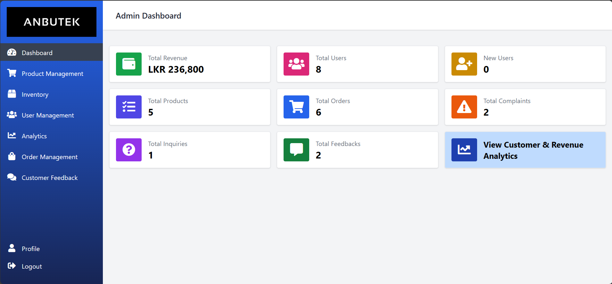

# E-Commerce CRM System


## Table of Contents
1. [Introduction](#introduction)
2. [Project Report](#project-report)
3. [Features](#features)
4. [Technologies Used](#technologies-used)
5. [Prerequisites](#prerequisites)
6. [Installation](#installation)
7. [License](#license)

## Introduction
Welcome to the Anbutek CRM System, a comprehensive solution designed for managing customer relationships and enhancing business productivity at Anbutek, an Audio & Gaming Store with a mobile application for e-commerce. This system addresses the challenges faced by Anbutek in customer management, product tracking, and revenue analysis.




## Project Report
[SSP - Project Report (View Word Document)](https://docs.google.com/document/d/1pBbgyVGRW-0vslhdn1WDmNztyceHdHQD/edit?usp=sharing&ouid=116508383828404552386&rtpof=true&sd=true)

## Features
- **Dashboard**: User-friendly interface providing key business metrics and insights.
- **Product Management**: Efficiently manage product listings and details.
- **Inventory Management**: Control product inventory and stock status.
- **User Management**: Manage user accounts, orders, and interactions.
- **Analytics**: Gather accurate data for decision-making.
- **Order Management**: Record and manage customer orders.
- **Customer Feedback**: Address customer inquiries, feedback, and complaints.
- **Mobile App**: Seamless user experience with various screens.

## Technologies Used
- Laravel Jetstream
- Tailwind CSS
- AlpineJS
- Livewire

## Prerequisites
Before you begin, ensure you have met the following requirements:
- PHP 7.4 or higher
- Composer
- Node.js and NPM
- MySQL

## Installation

To install and set up the Anbutek CRM System, follow these steps:

1. Clone the repository:

   ```bash
   git clone https://github.com/Sxjxd/Anbutek-CRM.git

2. Navigate to the project directory:
    ```bash
   cd Anbutek-CRM

3. Enter the following commands:
    ```bash
    composer install
    npm install
    npm run dev

You are all set and good to go now! Happy coding!
